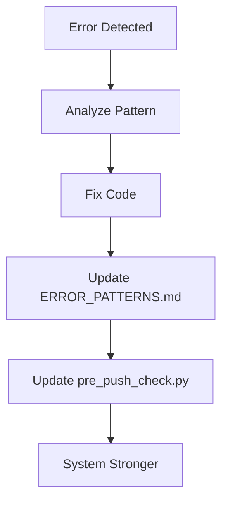

# ANTIGRAVITY SYSTEM KERNEL v1.0
# The Central Nervous System of Project ZKalkulator

**STATUS:** ACTIVE
**PRIME DIRECTIVE:** Continuous Self-Optimizing Intelligence
**LAST UPDATE:** 2026-01-25

---

## 1. THE CORE OBJECTIVE
This project is not just code. It is an evolving organism.
**Project Goal:** Build the ultimate "MargenKalkulator" for enterprise use.
**Meta Goal:** Create a "Super AI" workflow that analyzes its own errors, learns from them, and prevents them algorithmically.

> [!IMPORTANT]
> **Every Action Must:**
> 1. Advance the codebase.
> 2. Strengthen the system's stability.
> 3. Document the learning for future prevention.

---

## 2. THE SELF-ANNEALING PROTOCOL (The Algorithm)

We do not just fix bugs. We anneal the system to be harder, better, faster.

### The Loop

### Protocol Rules
1.  **Never Ignore a Failure:** Every red CI flag is a lesson.
2.  **Pattern Over Instance:** Don't just fix line 50. Ask "Why did line 50 fail?"
3.  **Codified Prevention:** If an error happens twice, a script must exist to block it the third time (see `execution/pre_push_check.py`).

---

## 3. ARCHITECTURAL DYNAMICS

### Structural Integrity (Feature Sliced Design)
*   **Core (`src/shared`)**: Atomic, independent. No upward dependencies.
*   **Domain (`src/entities`)**: Business logic (Math, Types). Depends on Core.
*   **Feature (`src/features`)**: User capabilities. Depends on Domain/Core.
*   **App (`src/pages`)**: Composition. Depends on everything.

**Rule:** Dependencies flow DOWN. Never UP. Never SIDEWAYS between features.
**Enforcement:** `eslint-plugin-boundaries` & `dependency-cruiser`.

### Mathematical Invariance
*   **Result:** Must be deterministic.
*   **Tool:** `decimal.js` for all money. No generic `number` for currency.
*   **Validation:** Property-Based Testing (`fast-check`) to prove correctness across infinite inputs.

---

## 4. DEPLOYMENT & OPERATION (Lovable Cloud)

*   **Platform:** Lovable (Supabase Wrapper).
*   **Credential Rule:** API Keys are managed by Lovable. We do NOT look for `SUPABASE_KEY` in env vars for production deployments.
*   **Constraint:** No direct `supabase.com` dashboard access.
*   **Workaround:** Use `mcp_supabase` tools or local emulation.

**Quality Gate:**
1.  Type Check
2.  Lint (0 Errors)
3.  Build Check
4.  No `src/node_modules`
5.  No iCloud Duplicates

---

## 5. DOCUMENTATION HIERARCHY

This file (`ANTIGRAVITY_KERNEL.md`) is the root.

*   `directives/SOP_DEPLOYMENT_LOVABLE.md` → Deployment Details
*   `directives/ERROR_PATTERNS.md` → The Registry of Failure & Fixes
*   `directives/QA_MANIFEST.md` → Deep Quality Philosophy
*   `execution/pre_push_check.py` → The Enforcer

---

## 6. KNOWLEDGE BASE INDEX

The 9 Deep Research documents provide the theoretical foundation:

| Doc | Topic | Key Concepts |
|-----|-------|--------------|
| 1 | Systemarchitektur | Evidence-Based Engineering, Anti-Vibe Coding |
| 2 | Enterprise Engineering | Backend Black Box, Edge Functions |
| 3 | Technische Implementierung | Monorepo, Event-Driven Architecture |
| 4 | SecOps Playbook | RLS, Honeytokens, Active Defense |
| 5 | Operational Workflow | Contract-First, Zod Validation |
| 6 | Qualitätssicherung | Property-Based Testing, pgTAP |
| 7 | Design System | Vodafone Aesthetic, Shadcn UI |
| 8 | Autonomous Orchestration | DOE Framework, Self-Annealing |
| 9 | QA Ergänzung | Additional Testing Patterns |

**Location:** `knowledge/*.md`

---

## 7. COMMANDMENTS FOR THE AI AGENT

1.  **Read This First:** Before starting a complex task, re-read this Kernel.
2.  **Update the Kernel:** If you learn a new fundamental truth, write it down here.
3.  **Check the Patterns:** Before coding, check `ERROR_PATTERNS.md` for traps.
4.  **Run the Validator:** Before asking the user to push, run `python3 execution/pre_push_check.py`.
5.  **Read GEMINI.md:** At the start of every new session, read the root `GEMINI.md`.

